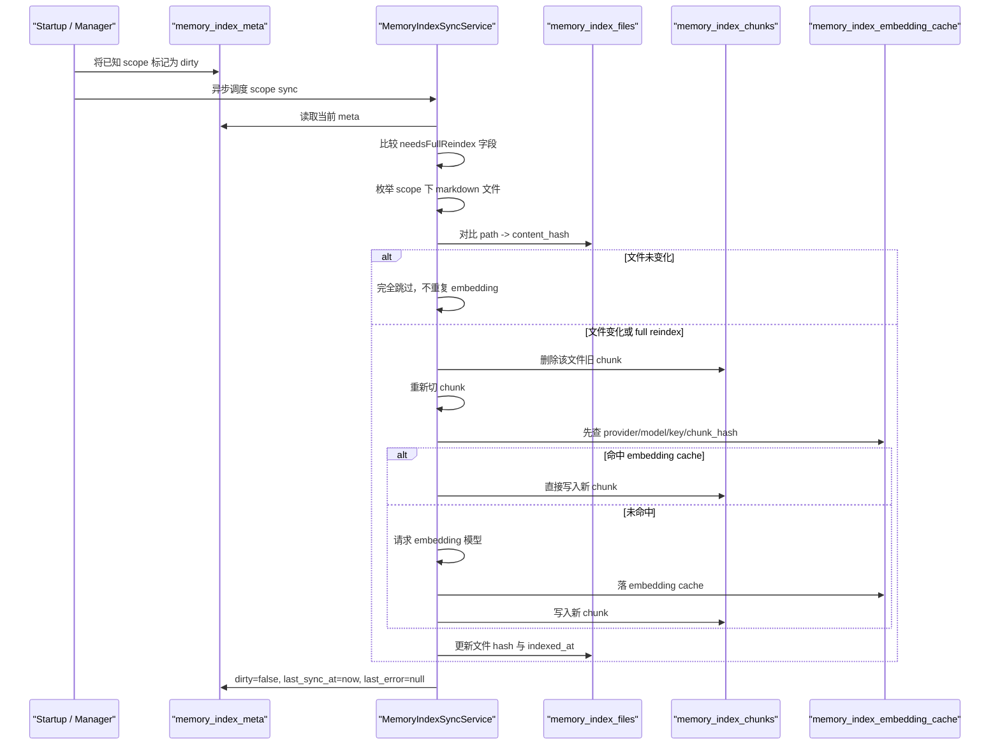

# 第七阶段：记忆 PG 后台增量同步机制

## 本阶段目标

这一阶段把 OpenClaw 风格的 `meta / files / embedding_cache` 同步机制真正落到 PG。

目标是让 memory 索引具备下面这套运行语义：

- 启动后先把 scope 标成 `dirty`
- 旧索引不清空，仍然可以先提供查询
- 后台异步执行 `runSync()`
- sync 先做 `needsFullReindex`
- 普通文件变化只走增量刷新
- chunk 文本没变时直接复用 embedding cache

## sync 时序图

## Dirty 语义

这一阶段把 `dirty` 的含义收紧为：

- `dirty=true`
  - 这份 scope 需要被重新校验
  - 不代表旧 chunk 不可用
  - 只代表后台应该尽快跑一轮 sync
- `dirty=false`
  - 当前 scope 的配置元信息和文件快照已经和磁盘状态对齐

`MemoryIndexManager` 在应用 ready 后会：

1. 先把 `memory_index_meta` 里已有 scope 置脏
2. 再根据磁盘上的 `MEMORY.md` 与 `memory/users/*` 发现 scope
3. 异步逐个调度 `runSync()`

这样可以满足“重启后旧索引先可用，后台慢慢校验”的启动语义。

## 文件 hash skip

本阶段正式启用：

- `memory_index_files.content_hash`

同步时会重新读取 scope 下的 markdown 文件，计算当前内容 hash，然后与库里的：

- `(scope_type, scope_id, path) -> content_hash`

逐个对比。

规则固定为：

- hash 一样
  - 整个文件跳过
  - 不删除旧 chunk
  - 不重新做 embedding
- hash 不一样
  - 删除该文件旧 chunk
  - 重新切 chunk
  - 重新落 `memory_index_files`
- 文件被删掉
  - 删除对应 `memory_index_files`
  - 删除对应 `memory_index_chunks`

## chunk 级 embedding 复用

本阶段把 embedding 复用的粒度收紧到 chunk：

- key：`provider + model + provider_key_fingerprint + chunk_hash`

同步时每个 chunk 先查 `memory_index_embedding_cache`：

- 命中
  - 直接反序列化旧向量
  - 不再请求 embedding 模型
- 未命中
  - 走一次 embedding 请求
  - 再写回 `memory_index_embedding_cache`

因此即使 scope 被判定成 full reindex，只要 chunk 文本没变，embedding 仍然可复用。

## full reindex 与增量 sync 的边界

### 触发 full reindex 的条件

只要下列元信息有任意一项变化，就走 full reindex：

- `index_version`
- `provider`
- `model`
- `provider_key_fingerprint`
- `sources_json`
- `scope_hash`
- `chunk_chars`
- `chunk_overlap`
- `vector_dims`

### 只走增量 sync 的条件

如果上面的元信息不变，则只看文件快照：

- 文件 hash 不变：跳过
- 文件 hash 变化：只重建该文件
- 文件删除：只删该文件相关记录

## 并发与失败处理

`MemoryIndexManager` 做了两层约束：

- 允许多个 scope 排队异步同步
- 不允许同一个 scope 并发 sync

实现上用：

- `pending` 集合记录待跑 scope
- `running` 标记控制同 scope 互斥

失败时：

- 事务回滚，避免 full reindex 半途把旧 chunk 清坏
- manager 在事务外重新把 scope 标脏，并写入 `last_error`
- 后续 watcher 或显式调度可以再次补跑

## 本阶段结果

这一阶段完成后已经具备：

- 冷启动首轮构建 PG memory 索引
- 重启后旧索引立即可读
- 后台异步增量校验
- 文件不变时不重复 embedding
- full reindex 时复用 embedding cache
