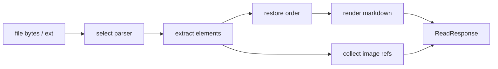

# Docreader 元素顺序保持 SOP

## 1. 目标与适用范围

这份 SOP 用于约束 `docreader_service` 的解析实现，目标不是像 PDF/Word 阅读器那样像素级复刻原文版式，而是尽量保持文档内文字、表格、图片的行级阅读顺序，并统一输出为适合 RAG 的 Markdown。

适用对象：

- `docreader_service` 维护者
- 文档解析链路开发者
- 需要新增或重构解析器的工程师

这份 SOP 里的“行级顺序”定义如下：

- PDF：按页面内的阅读顺序组织文字、表格、图片
- DOCX：按文档流顺序组织标题、正文、图片、表格

核心原则：

- PDF：按页面阅读顺序组织元素
- DOCX：按文档流顺序组织元素
- 表格：统一转 Markdown table
- 图片：正文里只保留临时逻辑引用，二进制通过 `imageRefs` 返回

## 2. 统一输出契约

所有解析器最终都必须统一输出以下结构：

- `markdownContent`
- `imageRefs`
- `metadata`
- `error`

约束如下：

- `markdownContent` 是一个大的 Markdown 字符串
- 表格必须作为 Markdown table 插入 `markdownContent`
- 图片必须以 Markdown 图片占位插入 `markdownContent`
- 图片二进制不能直接嵌在 `markdownContent` 里，必须通过 `imageRefs` 单独返回

最小示例：

```json
{
  "markdownContent": "# 标题\n\n正文第一段\n\n",
  "imageRefs": [
    {
      "originalRef": "images/demo.png",
      "fileName": "demo.png",
      "mimeType": "image/png",
      "bytesBase64": "iVBORw0KGgoAAA..."
    }
  ],
  "metadata": {
    "source_ext": ".pdf"
  },
  "error": ""
}
```

## 3. 总体数据流

统一解析链路固定为以下 6 步：

1. 读取文件字节流和扩展名
2. 根据扩展名选择解析器
3. 从底层库抽取元素
4. 恢复元素顺序
5. 把元素渲染为一个大的 Markdown 字符串
6. 收集图片引用并组装 `ReadResponse`

流程图：



统一元素模型是一个概念层抽象，用于说明“不同解析器先抽元素，再统一渲染”：

```python
elements = [
    {"kind": "text", "order": 10, "content": "正文"},
    {"kind": "table", "order": 20, "rows": [["A", "B"], ["1", "2"]]},
    {"kind": "image", "order": 30, "image_ref": "images/abc.png"},
]
```

这里的关键点不是字段名，而是：

- 不同格式的差异只在“元素怎么抽”
- 所有格式最终都要收口成同一种顺序元素流

## 4. PDF 解析 SOP

PDF 固定采用分流策略：

- 图文混排、版式依赖强：优先 `PyMuPDF`
- 正文和规则表格为主：优先 `pdfplumber`

两条路径的最终目标相同：

- 在页面级别尽量保持阅读顺序
- 产出统一的 Markdown 页面内容
- 页面之间再拼成整篇 Markdown

### 4.1 PyMuPDF 路径

`PyMuPDF` 的优势是原生提供页面块模型。推荐使用：

- `page.get_text("dict")`
- `page.get_images(full=True)`
- `doc.extract_image(xref)`

`page.get_text("dict")` 的核心层级可以理解为：

- `page`
- `blocks`
- `lines`
- `spans`

说明：

- `block["type"] == 0` 表示文本块
- `block["type"] == 1` 表示图片块
- 文本块本身已经带有页面顺序，所以可以直接按 block 顺序组织输出

这段示例用于说明实现思路，不代表完整生产实现。

```python
import fitz
import uuid

doc = fitz.open("demo.pdf")
page = doc[0]
page_dict = page.get_text("dict")

page_parts = []

for block in page_dict.get("blocks", []):
    # 文本块：按 line / span 顺序拼接
    if block.get("type") == 0:
        line_texts = []
        for line in block.get("lines", []):
            spans = line.get("spans", [])
            text = "".join(span.get("text", "") for span in spans).strip()
            if text:
                line_texts.append(text)
        if line_texts:
            page_parts.append("\n".join(line_texts))

    # 图片块：在正文里插入临时图片引用
    elif block.get("type") == 1:
        image_ref = f"images/{uuid.uuid4().hex}.png"
        page_parts.append(f"")

# 图片二进制一般单独通过 xref 提取
for item in page.get_images(full=True):
    xref = item[0]
    extracted = doc.extract_image(xref)
    payload = extracted.get("image")
    ext = extracted.get("ext", "png")
    if payload:
        # 这里通常会把 payload 编码到 imageRefs，而不是直接写入 markdown
        pass

page_markdown = "\n\n".join(page_parts)
```

适用判断：

- 页面有较多图片块
- 页面文本块较碎
- 页面顺序恢复更依赖 block 流而不是规则表格检测

### 4.2 pdfplumber 路径

`pdfplumber` 的思路与 `PyMuPDF` 不同。它没有现成的“按阅读顺序排列的 block 流”，更常见的是：

- `page.extract_words()`
- `page.find_tables()`
- `table.bbox`
- `table.extract()`

结论：

- `pdfplumber` 不是原生 block 模型
- 要做“正文 + 表格”的顺序混排时，需要基于坐标自己组装 `block-like elements`

这里“统一放进一个列表”的意思是：

- 文本行元素来自 `page.extract_words()`
- 表格元素来自 `page.find_tables()`
- 两者都必须带一个可排序的 `top`
- 再把它们统一放入一个 `elements` 列表
- 最后按 `top` 排序并顺序输出

不要直接做：

- `extract_text() + extract_tables()`

原因：

- 这样会得到“正文一坨 + 表格一坨”
- 但会丢掉表格在页面里的相对位置
- 也容易让表格文本重复进入正文

正确步骤：

1. 用 `find_tables()` 找表格
2. 从 `table.bbox` 读取表格位置
3. 用 `extract_words()` 抽取词块
4. 过滤掉落在表格 bbox 内的词块
5. 把剩余词块聚合成文本行
6. 把文本行元素和表格元素统一放进一个列表
7. 按 `top` 排序
8. 依次输出成 Markdown

顺序示例：

- `text(top=120) -> table(top=260) -> text(top=430)`

这段示例用于说明实现思路，不代表完整生产实现。

```python
import pdfplumber

def rows_to_md_table(rows):
    rows = rows or []
    rows = [[("" if cell is None else str(cell).strip()) for cell in row] for row in rows]
    rows = [row for row in rows if any(cell for cell in row)]
    if not rows:
        return ""

    header = rows[0]
    body = rows[1:]
    lines = [
        "| " + " | ".join(header) + " |",
        "| " + " | ".join(["---"] * len(header)) + " |",
    ]
    for row in body:
        lines.append("| " + " | ".join(row) + " |")
    return "\n".join(lines)

with pdfplumber.open("demo.pdf") as pdf:
    page = pdf.pages[0]
    elements = []

    # 1) 先找表格，并把表格元素放进统一列表
    tables = page.find_tables()
    table_bboxes = [table.bbox for table in tables]

    for table in tables:
        elements.append({
            "kind": "table",
            "top": table.bbox[1],   # bbox = (x0, top, x1, bottom)
            "rows": table.extract()
        })

    # 2) 再取词块，并过滤掉落在表格区域里的词块
    words = page.extract_words()
    normal_words = []

    for word in words:
        in_table = False
        for x0, top, x1, bottom in table_bboxes:
            if (
                word["x0"] >= x0 and word["x1"] <= x1
                and word["top"] >= top and word["bottom"] <= bottom
            ):
                in_table = True
                break
        if not in_table:
            normal_words.append(word)

    # 3) 把词块按 top 聚成文本行
    line_map = {}
    for word in normal_words:
        key = round(word["top"], 1)
        line_map.setdefault(key, []).append(word)

    for top, line_words in line_map.items():
        line_words.sort(key=lambda item: item["x0"])
        text = " ".join(item["text"] for item in line_words).strip()
        if text:
            elements.append({
                "kind": "text",
                "top": top,
                "content": text
            })

    # 4) 文本行元素和表格元素已经在同一个列表中，统一按 top 排序
    elements.sort(key=lambda item: item["top"])

    # 5) 按顺序输出 Markdown
    page_parts = []
    for elem in elements:
        if elem["kind"] == "text":
            page_parts.append(elem["content"])
        elif elem["kind"] == "table":
            page_parts.append(rows_to_md_table(elem["rows"]))

    page_markdown = "\n\n".join(part for part in page_parts if part.strip())
```

## 5. DOCX 解析 SOP

DOCX 不能只保留文字和表格，必须同时处理：

- 文字
- 图片
- 表格

并且必须尽量保住真实文档流顺序。

这里的顺序恢复分两层：

- 块级顺序：解决“段落和表格谁先谁后”
- 段落内部顺序：解决“文字和图片谁先谁后”

### 5.1 块级顺序

推荐使用真实 API：

- `Document(...)`
- `doc.iter_inner_content()`

`doc.iter_inner_content()` 会按文档里的真实顺序返回：

- `Paragraph`
- `Table`

它解决的是：

- 段落和表格之间的顺序问题
- 如“正文 -> 表格 -> 说明段落”这样的结构

这段示例用于说明实现思路，不代表完整生产实现。

```python
from docx import Document
from docx.table import Table
from docx.text.paragraph import Paragraph

doc = Document("demo.docx")
blocks = []

for block in doc.iter_inner_content():
    if isinstance(block, Paragraph):
        blocks.append({"kind": "paragraph", "block": block})
    elif isinstance(block, Table):
        blocks.append({"kind": "table", "block": block})

# blocks 顺序就是文档流顺序
```

### 5.2 段落内部顺序

块级顺序还不够，因为段落内部也可能同时有：

- 文字
- 图片

推荐使用真实 API：

- `paragraph.iter_inner_content()`
- `run.iter_inner_content()`

这两层 API 的作用：

- `paragraph.iter_inner_content()` 用来按段落内顺序拿 `Run` 或 `Hyperlink`
- `run.iter_inner_content()` 用来按 run 内顺序拿文本、`Drawing` 等内容

DOCX 图片场景默认以 inline picture 为主。也就是说，这里的目标是保住“文字 -> 图片 -> 文字”的段落内顺序，而不是复刻所有复杂浮动对象。

实现策略上，DOCX 推荐在第一遍顺序恢复时就直接提取图片二进制，而不是像 PDF 那样天然拆成“两阶段”：

- PDF 更适合两阶段，是因为页面顺序和图片 payload 常常来自两组不同 API：
  - `page.get_text("dict")` 负责页面块顺序
  - `page.get_images(full=True)` / `doc.extract_image(xref)` 负责图片二进制
- DOCX 更适合一阶段，是因为图片本来就在文档流里：
  - 当前正在处理的 `Run`
  - 当前图片的 `r:embed`
  - 当前图片对应的 `related_parts[rId].blob`
  这些信息在同一个遍历上下文里就能拿全

因此，DOCX 的推荐做法是：

1. 第一遍按文档流恢复顺序
2. 当遍历到图片位置时，立即插入 ``
3. 同时从 `run.part.related_parts[rId].blob` 提取图片二进制
4. 立即追加到 `imageRefs`

最终效果应该接近：

- 标题 -> 正文 -> 图片 -> 正文 -> 表格 -> 正文

这段示例用于说明实现思路，不代表完整生产实现。

```python
import base64
import uuid
from docx import Document
from docx.oxml.ns import qn
from docx.table import Table
from docx.text.paragraph import Paragraph
from docx.text.run import Run


def guess_image_ext(content_type: str, partname: str) -> str:
    ctype = (content_type or "").lower()
    name = (partname or "").lower()

    if "png" in ctype or name.endswith(".png"):
        return "png"
    if "jpeg" in ctype or "jpg" in ctype or name.endswith(".jpg") or name.endswith(".jpeg"):
        return "jpg"
    if "gif" in ctype or name.endswith(".gif"):
        return "gif"
    if "webp" in ctype or name.endswith(".webp"):
        return "webp"
    return "bin"


def iter_runs_in_paragraph(paragraph: Paragraph):
    # paragraph.iter_inner_content() 会返回 Run / Hyperlink；
    # 这里统一展开成 run 流，便于保持段落内部顺序
    for item in paragraph.iter_inner_content():
        if isinstance(item, Run):
            yield item
        elif hasattr(item, "runs"):
            for run in item.runs:
                yield run

doc = Document("demo.docx")
parts = []
image_refs = []

for block in doc.iter_inner_content():
    # 1) 段落：按段落内顺序处理文字和图片
    if isinstance(block, Paragraph):
        paragraph_parts = []
        style_name = (block.style.name or "").strip()

        for run in iter_runs_in_paragraph(block):
            # 先按 run 内顺序保留纯文本
            for inner in run.iter_inner_content():
                if isinstance(inner, str):
                    paragraph_parts.append(inner)

            # 再从当前 run 的 drawing 关系里提取图片
            blips = run._element.xpath(".//*[local-name()='blip']")
            for blip in blips:
                r_id = blip.get(qn("r:embed"))
                if not r_id:
                    continue

                image_part = run.part.related_parts[r_id]
                payload = image_part.blob
                content_type = getattr(image_part, "content_type", "application/octet-stream")
                partname = str(getattr(image_part, "partname", "") or "")
                ext = guess_image_ext(content_type, partname)

                image_ref = f"images/{uuid.uuid4().hex}.{ext}"

                # 图片占位直接写进正文当前位置
                paragraph_parts.append(f"")

                # 图片二进制在第一遍遍历时直接加入 imageRefs
                image_refs.append({
                    "originalRef": image_ref,
                    "fileName": image_ref.split("/")[-1],
                    "mimeType": content_type,
                    "bytesBase64": base64.b64encode(payload).decode("ascii"),
                })

        paragraph_text = "".join(paragraph_parts).strip()
        if paragraph_text:
            if style_name.startswith("Heading 1"):
                parts.append(f"# {paragraph_text}")
            elif style_name.startswith("Heading 2"):
                parts.append(f"## {paragraph_text}")
            else:
                parts.append(paragraph_text)

    # 2) 表格：保持块级顺序，直接转 Markdown table
    elif isinstance(block, Table):
        rows = []
        for row in block.rows:
            rows.append([cell.text.strip() for cell in row.cells])
        parts.append(rows_to_md_table(rows))

markdown = "\n\n".join(part for part in parts if part.strip())
```

兼容性说明：

- 这里使用的是 `python-docx` 的真实 API 名
- 这里采用的是“一阶段提图”策略：恢复顺序时直接拿图片 payload
- 如果团队锁定的具体版本缺少某个迭代辅助 API，可以退回到更底层的 body child 遍历方式
- 但顺序设计原则不变：先保块级顺序，再保段落内部顺序

## 6. 表格统一表示 SOP

表格来源可能包括：

- PDF
- DOCX
- CSV
- XLSX/XLS

无论来源是什么，统一中间表示必须固定为二维数组：

```python
rows = [
    ["姓名", "部门", "电话"],
    ["张三", "产品", "123"]
]
```

最终统一渲染成 Markdown table：

```md
| 姓名 | 部门 | 电话 |
| --- | --- | --- |
| 张三 | 产品 | 123 |
```

这一步是所有结构化表格的统一收口点。下游不应该再关心“这个表格来自 PDF 还是 Word”。

这段示例用于说明实现思路，不代表完整生产实现。

```python
def rows_to_md_table(rows):
    rows = rows or []
    rows = [[("" if cell is None else str(cell).strip()) for cell in row] for row in rows]
    rows = [row for row in rows if any(cell for cell in row)]
    if not rows:
        return ""

    header = rows[0]
    body = rows[1:]

    lines = [
        "| " + " | ".join(header) + " |",
        "| " + " | ".join(["---"] * len(header)) + " |",
    ]
    for row in body:
        lines.append("| " + " | ".join(row) + " |")
    return "\n".join(lines)
```

## 7. 图片提取与临时引用 SOP

图片必须采用“正文占位 + 二进制单独返回”的方式处理。

正文里只放临时逻辑引用，例如：

```md

```

图片二进制通过 `imageRefs` 单独返回。字段含义：

- `originalRef`：正文中的逻辑引用名
- `fileName`：建议落存时使用的文件名
- `mimeType`：图片 MIME 类型
- `bytesBase64`：图片原始二进制的 Base64 编码

对应关系必须一一成立：

- `markdownContent` 里出现的 `images/<uuid>.<ext>`
- 必须在 `imageRefs.originalRef` 中出现相同值

这样设计的原因：

- 解析阶段不绑定具体对象存储系统
- 正文只负责表达图片位置
- 存储层后续可以上传图片并把临时引用替换为最终 URL

实现上有两种常见策略：

- PDF / `PyMuPDF`：更适合“两阶段”
  - 第一阶段恢复页面顺序并插入图片占位
  - 第二阶段再用 `get_images/extract_image` 统一提取 payload
- DOCX / `python-docx`：更适合“一阶段”
  - 在恢复段落内顺序的同时，直接通过 `run.part.related_parts[rId].blob` 提图
  - 当场写入 `imageRefs`

两种策略都允许，但必须满足同一个约束：

- 正文里的临时引用必须和 `imageRefs.originalRef` 一一对应

这段示例用于说明实现思路，不代表完整生产实现。

```python
import base64
import uuid

image_refs = []

def append_image_placeholder(markdown_parts, payload, ext):
    image_ref = f"images/{uuid.uuid4().hex}.{ext}"

    # 1) 正文只插临时逻辑引用
    markdown_parts.append(f"")

    # 2) 图片二进制单独放进 imageRefs
    image_refs.append({
        "originalRef": image_ref,
        "fileName": image_ref.split("/")[-1],
        "mimeType": f"image/{ext}",
        "bytesBase64": base64.b64encode(payload).decode("ascii"),
    })
```

推荐替换链路：

1. 解析器生成 `markdownContent` 和 `imageRefs`
2. 存储层上传 `imageRefs` 里的图片
3. 存储层根据 `originalRef` 找到正文里的临时引用
4. 替换为最终可访问 URL

## 8. 最终输出示例

完整的 `markdownContent` 示例：

```md
# 操作说明

这是图片上方的正文。


| 姓名 | 部门 | 电话 |
| --- | --- | --- |
| 张三 | 产品 | 123 |

这是表格下方的补充说明。
```

完整 `ReadResponse` 示例：

```json
{
  "markdownContent": "# 操作说明\n\n这是图片上方的正文。\n\n\n\n| 姓名 | 部门 | 电话 |\n| --- | --- | --- |\n| 张三 | 产品 | 123 |\n\n这是表格下方的补充说明。",
  "imageRefs": [
    {
      "originalRef": "images/3f6c9f2a.png",
      "fileName": "3f6c9f2a.png",
      "mimeType": "image/png",
      "bytesBase64": "iVBORw0KGgoAAA..."
    }
  ],
  "metadata": {
    "source_ext": ".pdf",
    "user_id": "anonymous",
    "job_id": "job-demo-1"
  },
  "error": ""
}
```

这里要明确：

- 保住的是语义顺序和阅读顺序
- 不是像素级排版

## 9. 边界与取舍

PDF：

- 多栏页面可能无法完全准确恢复阅读顺序
- 图文极复杂页优先用 `PyMuPDF`
- `pdfplumber` 更适合正文和规则表格型页面

DOCX：

- 重点支持 inline picture
- 不承诺复杂浮动对象完全还原
- 块级顺序和段落内顺序优先于版式复刻

总原则：

- 对 RAG 足够稳定和可检索
- 不追求阅读器级渲染精度

## 10. 参考 API 与资料

`PyMuPDF`：

- `page.get_text("dict")`
- `page.get_images(full=True)`
- `doc.extract_image(xref)`
- https://pymupdf.readthedocs.io/en/latest/app1.html
- https://pymupdf.readthedocs.io/en/latest/recipes-images.html

`pdfplumber`：

- `page.extract_words()`
- `page.find_tables()`
- `table.bbox`
- `table.extract()`
- https://github.com/jsvine/pdfplumber

`python-docx`：

- `Document(...)`
- `doc.iter_inner_content()`
- `paragraph.iter_inner_content()`
- `run.iter_inner_content()`
- https://python-docx.readthedocs.io/en/latest/api/document.html
- https://python-docx.readthedocs.io/en/latest/_modules/docx/text/paragraph.html
- https://python-docx.readthedocs.io/en/latest/_modules/docx/text/run.html
- https://python-docx.readthedocs.io/en/latest/user/shapes.html
