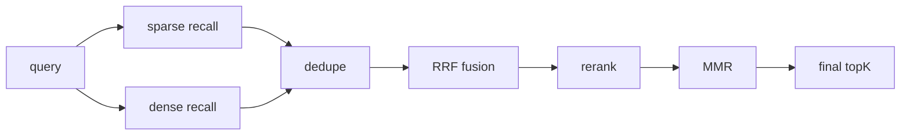

# 混合检索、Rerank 与 MMR SOP

## 1. 目标与适用范围

这份 SOP 用于约束 `agentic_rag_app` 在知识检索阶段的召回、融合、重排和多样性控制策略。它既解释当前仓库里已经实现的检索链路，也定义后续推荐方案，避免在“当前实现”和“目标设计”之间混淆。

适用对象：

- `agentic_rag_app` 维护者
- 检索链路开发者
- 需要调优 RAG 召回、重排和上下文构造的工程师

这份 SOP 重点回答以下问题：

1. 当前项目的 hybrid retrieval 是怎么工作的
2. 当前 sparse 和 dense 各自的分数语义是什么
3. 为什么当前推荐 `RRF`，而不是直接把原始分数相加
4. 为什么当前 dense 的 `L2 + 1 / (1 + d)` 只是现状，不是推荐长期主方案
5. FTS 的 `ts_rank / ts_rank_cd` 和标准 BM25 到底是什么关系
6. rerank 和 MMR 应该在检索链路中放在哪里

核心原则：

- 当前实现要如实描述，不能把目标方案写成现状
- Sparse 与 dense 的原始分数不能直接视为同一量纲
- `RRF` 负责稳健融合，rerank 负责精排，MMR 负责多样性
- Dense 的长期推荐主线是 cosine，相比当前 L2 更易解释阈值和相似度
- Sparse 当前继续接受 PostgreSQL FTS，但文档必须补足 BM25 的公式与对照解释

## 2. 总图与现状 vs 目标

推荐总流程：

```text
Query
 -> Sparse recall (FTS / keyword)
 -> Dense recall (embedding)
 -> RRF fusion
 -> Rerank scoring
 -> MMR diversification
 -> Final topK context
```

当前实现与目标方案对照如下：

| 环节 | 当前实现 | 目标方案 |
| --- | --- | --- |
| Sparse | PostgreSQL FTS + `ts_rank/ts_rank_cd` | 继续保留 FTS，不伪装成 BM25 |
| Dense | L2 distance + `1 / (1 + d)` 映射分 | 推荐切到 cosine 主线 |
| Fusion | `RRF` | 继续使用 `RRF` |
| Rerank | 接口已存在，默认 embedding cosine rerank | 推荐引入 cross-encoder / rerank model |
| MMR | 未实现 | 推荐新增 |

这里要特别明确：

- 当前项目的 sparse 检索不是标准 BM25
- 当前项目的 dense 检索分数不是天然 cosine 相似度
- 当前项目已经真实落地的是：并行 sparse + dense、RRF 融合、接口式 rerank

## 3. 当前实现小结

当前知识检索入口在 `KnowledgeSearchTool`。它会把用户 query 直接交给 `HybridRetriever`，默认参数为：

- `recallTopK = 20`
- `rerankTopK = 5`

当前检索链路可以概括为：

```text
KnowledgeSearchTool
 -> HybridRetriever
    -> DenseVectorRetriever
    -> PostgresBm25Retriever / LuceneBm25Retriever
 -> RRF fusion
 -> Reranker
 -> ContextAssembler
```

当前实现的关键事实：

- `HybridRetriever` 使用 `CompletableFuture` 并行跑稀疏和稠密召回
- 稠密与稀疏召回结果通过 `RRF` 融合
- `Reranker` 接口存在，默认实现为 `EmbeddingCosineReranker`
- 当前没有实现 MMR

必须明确指出的几个边界：

1. 当前 PG dense 路径按 `vector <-> query` 排序，本质是 L2 距离
2. 当前 `retrieval_score = 1 / (1 + distance)` 只是展示分，不是模型天然输出的相似度
3. 当前 sparse 路径是 PostgreSQL FTS 的 `ts_rank/ts_rank_cd`
4. 当前 PG 返回的 `TextChunk` 默认不带 embedding，因此 rerank 在 PG 路径下会退化为 fallback

## 4. 混合检索 SOP

标准 hybrid retrieval 固定由以下 6 步组成：

1. 并行 sparse recall
2. 并行 dense recall
3. 候选去重
4. `RRF` 融合
5. rerank
6. MMR 与最终 topK 选择

标准流程图：



### 4.1 为什么推荐 RRF

当前推荐 `RRF`，而不是直接对原始分数做加权求和。

原因：

- dense 与 sparse 的原始分数不在同一量纲
- FTS 分数、BM25 分数、dense 相似度分通常不可直接比较
- `RRF` 只依赖排名，不依赖原始分数尺度

`RRF` 公式：

```text
score = Σ 1 / (k + rank_i)
```

其中：

- `rank_i` 表示某个候选在第 `i` 路召回中的排名
- `k` 是平滑常数

当前项目里的实现相当于：

```text
score = 1 / (k + rank_dense) + 1 / (k + rank_sparse)
```

并以 `k = 60` 作为当前默认值。

### 4.2 如果以后要做权重融合

如果业务需要显式表达“dense 更重要”或“sparse 更重要”，推荐做加权 `RRF`：

```text
score =
  w_dense * 1 / (k + rank_dense)
+ w_sparse * 1 / (k + rank_sparse)
```

不推荐直接做：

```text
final = a * dense_score + b * sparse_score
```

原因：

- 原始分数不可直接比较
- 要先做复杂归一化
- 不同 query 下分布不稳定

## 5. Dense 检索 SOP

### 5.1 当前实现

当前 PG dense 路径使用的是 L2 距离，核心排序语义为：

```text
distance = q <-> d
```

当前返回给上层的展示分为：

```text
retrieval_score = 1 / (1 + distance)
```

这意味着：

- 距离越小，排序越靠前
- 展示分越大，表示越接近
- 但这个展示分不是 embedding 模型天然输出的 cosine 相似度

### 5.2 当前 L2 的公式

L2 距离定义为：

```text
L2(q, d) = sqrt(sum((q_i - d_i)^2))
```

含义：

- 它度量的是两个向量在空间中的欧氏距离
- 数值越小越相似

### 5.3 目标方案：推荐切到 Cosine 主线

长期推荐主线不是当前的 L2，而是 cosine similarity。

cosine 定义为：

```text
cos(q, d) = (q · d) / (||q|| ||d||)
```

含义：

- 它更关注向量方向是否一致
- 数值越大越相似

### 5.4 L2 与 Cosine 的差异

核心差异：

- L2 看空间距离
- cosine 看方向相似度

当向量已经做归一化时，L2 与 cosine 的排序结果往往会更接近；但在文档和工程讨论里，cosine 仍然更适合作为“相似度”来解释和设阈值。

### 5.5 Dense 阈值 SOP

当前项目没有做 dense 阈值过滤。

推荐原则：

- v1 不要一开始就用硬阈值卡召回
- 先以 `topK recall` 为主
- 如果后续需要阈值，优先按 cosine score 讨论

标准阈值引入流程：

1. 抽取真实 query 样本
2. 人工标注相关 / 不相关
3. 观察 dense 分数分布
4. 基于 precision / recall 权衡选择阈值

这里不在 SOP 中写死具体阈值数值，只定义流程。

## 6. Sparse 检索 SOP：FTS 与 BM25

这节必须明确分两部分讲：

- 当前项目用了 PostgreSQL FTS
- 当前项目没有实现标准 BM25

### 6.1 当前 FTS 路径

当前项目使用：

- `to_tsvector`
- `plainto_tsquery`
- `@@`
- `ts_rank`
- `ts_rank_cd`

它的核心语义是：

- `to_tsvector`：把文本转成全文 token 集合
- `plainto_tsquery`：把 query 转成全文检索 query
- `@@`：判断命中
- `ts_rank` / `ts_rank_cd`：给命中的文档排序

### 6.2 `ts_rank`

`ts_rank` 可以理解为 PostgreSQL 的基础全文相关性排序分。它是“命中后排序”的函数，不负责决定是否命中；是否命中仍由 `@@` 决定。

它依赖的输入参数是：

- 文档侧 `tsvector`
- 查询侧 `tsquery`
- 可选的 4 级权重数组 `weights = [w_D, w_C, w_B, w_A]`
- 可选的 `normalization` 位掩码

从统计量角度看，`ts_rank` 主要依赖：

- 文档内匹配 lexeme 的出现情况
- lexeme 的权重标签 `A/B/C/D`
- 可选归一化规则

它**不显式依赖**：

- 语料级 `df`
- 全库文档数 `N`
- 平均文档长度 `avgdl`

因此它和标准 BM25 不是一类打分函数。

从倒排检索语义上看，`ts_rank` 更接近：

- 从 `tsvector` 表示里取出“这个文档里哪些 query 词命中了、命中了几次、各自权重是什么”
- 再做一个文档内加权聚合

可以用一个**概念公式**来理解：

$$
\operatorname{ts\_rank}(D, Q)
=
\operatorname{Norm}\!\left(
\sum_{t \in Q \cap D} w(t, D) \cdot \operatorname{tf}(t, D)
\right)
$$

其中：

- $D$ 表示文档的 `tsvector`
- $Q$ 表示查询的 `tsquery`
- $\operatorname{tf}(t, D)$ 表示词项 $t$ 在文档 $D$ 中的出现强度
- $w(t, D)$ 表示词项在文档中的权重标签映射
- $\operatorname{Norm}(\cdot)$ 表示 PostgreSQL 可选的归一化步骤

要点是：

- 它表达的是“文档内命中词出现得多不多、权重大不大”
- 它不表达“这个词在全语料里稀不稀有”

所以它更适合同 query 内排序，而不是跨 query 的统一阈值判断。

### 6.3 `ts_rank_cd`

`ts_rank_cd` 里的 `cd` 表示 cover density。它在 `ts_rank` 的基础上，进一步强调：

- query 词项是否集中出现
- 词项之间是否更接近
- 多个命中词是否形成更紧凑的覆盖区间

它依赖的输入参数与 `ts_rank` 类似：

- 文档侧 `tsvector`
- 查询侧 `tsquery`
- 可选的 4 级权重数组 `weights`
- 可选的 `normalization`

但它额外依赖一个关键条件：

- 文档中的词位置信息必须存在

这意味着：

- `ts_rank_cd` 需要使用带 position 的 `tsvector`
- 如果 lexeme 被 strip 掉位置，`ts_rank_cd` 无法正确利用这些信息

从倒排检索语义上看，它不仅关心“命中了多少”，还关心“这些命中是不是挨得近”。可以用一个**概念公式**来理解：

$$
\operatorname{ts\_rank\_cd}(D, Q)
=
\operatorname{Norm}\!\left(
\sum_{e \in \mathcal{E}(D, Q)}
\frac{\sum_{t \in e} w(t, D)}{\operatorname{span}(e)}
\right)
$$

其中：

- $\mathcal{E}(D, Q)$ 表示文档 $D$ 中关于查询 $Q$ 的覆盖区间集合
- $\operatorname{span}(e)$ 表示某个覆盖区间的宽度

这个公式不是 PostgreSQL 内部源码的逐字展开，而是概念层表达。它想表达的核心思想是：

- 命中词如果集中在更短的区间里，得分更高
- 命中词如果分散得很开，得分会被削弱

因此它比 `ts_rank` 更偏重“命中聚集度”和“局部上下文紧凑性”。

### 6.4 标准 BM25 公式

尽管当前项目没有实现标准 BM25，但文档必须说明 BM25 的基本形式：

$$
\operatorname{BM25}(Q, D)
=
\sum_{t \in Q}
\operatorname{IDF}(t)
\cdot
\frac{
\operatorname{tf}(t, D)\,(k_1 + 1)
}{
\operatorname{tf}(t, D)
+ k_1\!\left(1 - b + b \cdot \frac{|D|}{\operatorname{avgdl}}\right)
}
$$

其中常见的 IDF 写法为：

$$
\operatorname{IDF}(t)
=
\log
\frac{
N - \operatorname{df}(t) + 0.5
}{
\operatorname{df}(t) + 0.5
}
$$

它依赖的统计量包括：

- $\operatorname{tf}(t, D)$：term frequency，词项在文档中的频次
- $\operatorname{df}(t)$：document frequency，词项出现于多少文档
- $N$：语料文档总数
- $|D|$：文档长度
- $\operatorname{avgdl}$：平均文档长度
- $k_1, b$：BM25 的控制参数

BM25 表达的思想与 `ts_rank/ts_rank_cd` 明显不同：

- 它奖励词项命中，但对 `tf` 做饱和处理，不让频次无限放大
- 它显式建模词项稀有度，通过 `idf` 提高稀有词价值
- 它显式建模文档长度，避免长文天然吃亏或短文天然占优

也就是说，BM25 是一个**带语料级统计量**的概率检索风格打分函数，而不只是文档内命中聚合。

### 6.5 FTS 与 BM25 的关系

必须明确写出结论：

- 可以基于倒排检索思想实现 BM25
- 但当前项目没这么做
- 当前项目的 sparse score 不是 BM25 score

这三者在“计算所需参数”和“表达思想”上的差别可以总结如下：

| 方法 | 主要输入 | 是否需要位置 | 是否需要语料级统计 | 核心思想 |
| --- | --- | --- | --- | --- |
| `ts_rank` | `tsvector`、`tsquery`、weights、normalization | 不强依赖 | 否 | 文档内词频加权相关性 |
| `ts_rank_cd` | `tsvector`、`tsquery`、weights、normalization | 是 | 否 | 文档内命中聚集度 / 接近度 |
| BM25 | `tf`、`df`、`N`、`|D|`、`avgdl`、`k_1`、`b` | 否 | 是 | 词频饱和 + 稀有词奖励 + 长度归一化 |

### 6.6 在 PostgreSQL 里如何理解“从倒排索引数据转换”

从检索思想上说，这三类方法都可以被视为建立在“倒排信息”之上：

- 哪个词命中了哪些文档
- 在某个文档里出现了几次
- 是否带位置
- 这个词在全语料里出现了多少文档

但要明确一点：

- PostgreSQL 的 GIN 倒排索引内部结构并不会直接以 SQL 可编程接口的形式暴露给业务层

所以在 PostgreSQL 里如果要做 BM25，一般不会写成“直接读取 GIN 内部 posting list 算分”，而是更常见地通过下面几类信息组合来实现：

1. 文档侧 `tsvector`
2. 词项统计或物化统计表
3. 文档长度表
4. 全局平均文档长度

也就是说，工程上通常是：

- 利用倒排检索语义来构建统计量
- 而不是在 SQL 层直接读取 GIN 内部数据结构

对于当前项目而言，应明确写成：

- 现在只使用 PostgreSQL FTS 排序
- 如果以后要实现标准 BM25，需要补一层显式统计量维护

### 6.7 在稀疏检索里用哪个好

这个问题不能脱离场景回答。

#### 如果目标是“尽量复用 PostgreSQL 原生能力、低工程复杂度”

优先级建议是：

1. `ts_rank_cd`
2. `ts_rank`

原因：

- 当前项目的检索粒度是 chunk
- chunk 通常比较短
- query 词在 chunk 中是否聚集，往往比“单纯命中多少次”更重要

因此，在 chunk 级 sparse 排序里，`ts_rank_cd` 通常比 `ts_rank` 更符合“命中更紧凑、语义更集中”的需求。

#### 如果目标是“更标准的词法检索评分”

优先级建议是：

1. BM25
2. `ts_rank_cd`
3. `ts_rank`

原因：

- BM25 显式建模 `idf` 和长度归一化
- 在传统 lexical retrieval 里，它通常比简单全文排序更标准

但代价是：

- 需要补充语料级统计量
- 工程复杂度高于直接使用 FTS

因此对当前项目的推荐写法应当是：

- **现状**：继续使用 FTS
- **FTS 内部排序优先选择**：`ts_rank_cd` 优于 `ts_rank`
- **长期如果要走标准 lexical retrieval 路线**：应单独实现 BM25，而不是把 `ts_rank` 叫作 BM25

### 6.8 Sparse 阈值 SOP

推荐原则：

- `ts_rank`
- `ts_rank_cd`
- BM25

都不适合像 cosine 那样做直觉型全局阈值。

更合理的用法是：

- 同 query 内排序
- topK 截断
- 或做保守的弱阈值

如果后续确实要给 sparse 引入阈值，也应是：

- 按语料校准
- 按 query 类型校准
- 保守地过滤极低分噪音

## 7. Rerank SOP

### 7.1 位置与职责

rerank 固定放在：

```text
RRF fusion -> rerank -> MMR -> final topK
```

职责：

- 输入：RRF 后的候选集
- 输出：每个候选的 relevance score
- 作用：把 coarse recall 候选重新排顺序

### 7.2 当前实现

当前仓库里：

- `Reranker` 接口已存在
- 默认实现是 `EmbeddingCosineReranker`

但由于 PG 检索返回的候选默认不带 embedding，当前 PG 路径下 rerank 会退化，更多表现为 fallback，而不是有效的 embedding 精排。

### 7.3 目标方案：cross-encoder / rerank model

推荐目标方案：

- 引入 cross-encoder / rerank model
- 例如 BGE reranker

输入形式：

```text
[(query, passage_1), (query, passage_2), ...]
```

输出形式：

```text
[score_1, score_2, ...]
```

返回分数与输入顺序一一对应。

### 7.4 Rerank 分数的使用原则

需要明确写清：

- rerank 分数通常只适合同 query 内排序
- 不应天然当成全局统一概率
- 有些模型原始输出不是 `0~1`
- 有些实现会提供 normalize / sigmoid 形式，但不应把它写成强制统一标准

## 8. MMR SOP

### 8.1 当前状态

当前项目没有实现 MMR。

### 8.2 推荐位置

默认位置定义为：

```text
RRF fusion -> Rerank scoring -> MMR diversification -> final topK
```

这样可以直接使用 rerank score 作为 relevance。

### 8.3 MMR 公式

MMR 定义为：

```text
MMR(d) = λ * Rel(query, d) - (1 - λ) * max Sim(d, selected)
```

其中：

- `Rel(query, d)`：候选与 query 的相关性
- `Sim(d, selected)`：候选与已选结果的重复度
- `λ`：相关性与多样性的权衡系数

### 8.4 推荐默认设计

推荐默认设计：

- `Rel(query, d)`：使用 rerank score
- `Sim(d, selected)`：使用 doc-doc cosine similarity
- `λ`：先作为可调参数，工程起点建议为 `0.7`

### 8.5 MMR 的目标

MMR 的目标不是替代 rerank，而是：

- 去掉高度重复 chunk
- 提高最终上下文覆盖面
- 在相关性和多样性之间做平衡

## 9. 分数、阈值与可比性总表

统一对照如下：

| 分数类型 | 当前是否已用 | 主要依赖参数 | 跨 query 可比性 | 适合全局阈值 | 适合 hybrid 融合 | 适合 MMR relevance |
| --- | --- | --- | --- | --- | --- | --- |
| Dense L2 映射分 | 是 | 距离 $d$ | 弱 | 一般 | 不推荐直接融合 | 不推荐 |
| Dense cosine 分 | 否，目标方案 | 向量点积与范数 | 中等偏强 | 相对更适合 | 仍建议先做 rank 融合 | 可用 |
| FTS `ts_rank` | 是 | 文档内 tf、权重、归一化 | 弱 | 不适合直觉型全局阈值 | 不推荐直接融合 | 不推荐 |
| FTS `ts_rank_cd` | 是 | 文档内 tf、位置、权重、归一化 | 弱 | 不适合直觉型全局阈值 | 不推荐直接融合 | 不推荐 |
| BM25 | 否，仅作原理说明 | tf、df、$N$、$|D|$、$\operatorname{avgdl}$、$k_1$、$b$ | 弱 | 不适合简单全局阈值 | 不推荐直接融合 | 不推荐 |
| rerank model score | 否，目标方案 | 模型对 $(q,d)$ 对的相关性判别 | 同 query 内强 | 不建议直接全局化 | 适合作为 rerank 分 | 推荐 |

结论：

- dense cosine 最适合做“相似度”解释和后续阈值设计
- FTS/BM25 更适合同 query 排序，不适合简单全局阈值
- rerank 分最适合作为同 query 内精排依据，以及 MMR 的 relevance

## 10. 结尾与决策收束

当前实现已经具备：

- hybrid retrieval
- 并行 sparse + dense recall
- `RRF` 融合
- 接口式 rerank

但仍需明确区分：

- 当前 sparse 是 FTS，不是 BM25
- 当前 dense 是 L2，不是 cosine
- 当前 rerank 在 PG 路径下效果打折
- 当前 MMR 尚未实现

推荐目标链路为：

```text
Query
 -> Sparse recall (FTS)
 -> Dense recall (Cosine)
 -> RRF
 -> Rerank model
 -> MMR
 -> topK context
```

最终建议收束为：

- Sparse 继续保留 FTS
- Dense 长期切到 cosine 主线
- 融合继续使用 `RRF`
- 精排使用专用 rerank model
- 多样性控制通过 MMR 完成

这样才能把“召回稳健性、排序精度和最终上下文覆盖面”三件事拆开处理，而不是把所有任务都压在单一路径或单一分数上。
